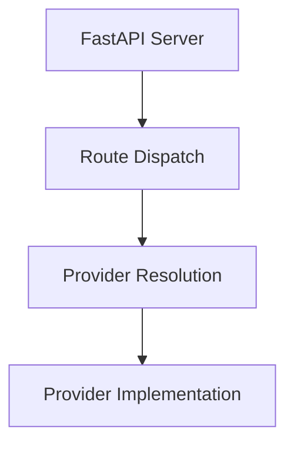

# System Overview

This document outlines the architecture of the system, detailing the components and their interactions. At the core of the system is the FastAPI Server, which handles all incoming requests. The Route Dispatch component is responsible for directing these requests to the appropriate handlers. The Provider Resolution layer checks the available providers based on the request parameters, and finally, the Provider Implementation executes the necessary actions based on the resolved provider.