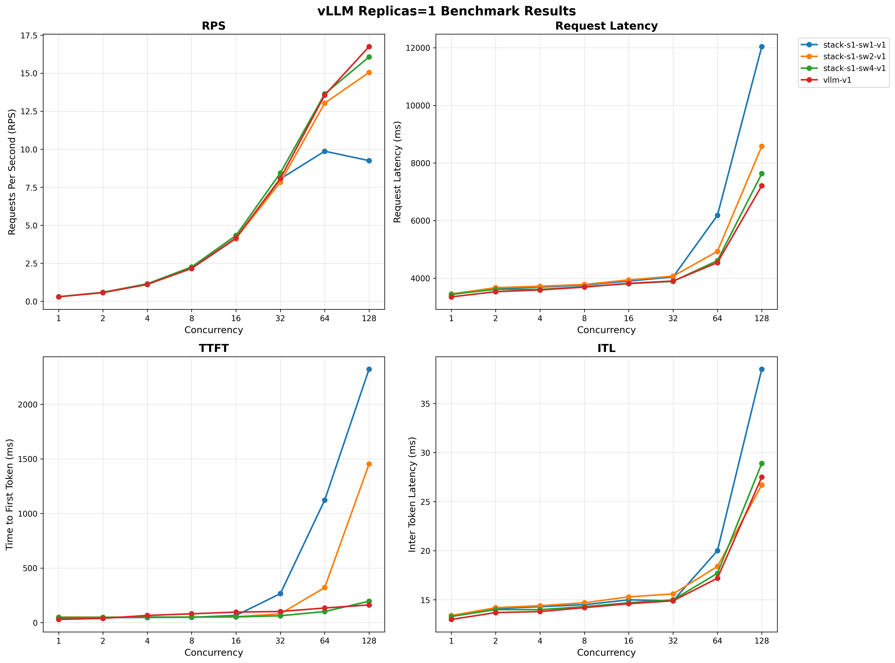

# Llama Stack Benchmark Suite on Kubernetes

## Motivation

Performance benchmarking is critical for understanding the overhead and characteristics of the Llama Stack abstraction layer compared to direct inference engines like vLLM.

### Why This Benchmark Suite Exists

**Performance Validation**: The Llama Stack provides a unified API layer across multiple inference providers, but this abstraction introduces potential overhead. This benchmark suite quantifies the performance impact by comparing:
- Llama Stack inference (with vLLM backend)
- Direct vLLM inference calls
- Both under identical Kubernetes deployment conditions

**Production Readiness Assessment**: Real-world deployments require understanding performance characteristics under load. This suite simulates concurrent user scenarios with configurable parameters (duration, concurrency, request patterns) to validate production readiness.

**Regression Detection (TODO)**: As the Llama Stack evolves, this benchmark provides automated regression detection for performance changes. CI/CD pipelines can leverage these benchmarks to catch performance degradations before production deployments.

**Resource Planning**: By measuring throughput, latency percentiles, and resource utilization patterns, teams can make informed decisions about:
- Kubernetes resource allocation (CPU, memory, GPU)
- Auto-scaling configurations
- Cost optimization strategies

### Key Metrics Captured

The benchmark suite measures critical performance indicators:
- **Throughput**: Requests per second under sustained load
- **Latency Distribution**: P50, P95, P99 response times
- **Time to First Token (TTFT)**: Critical for streaming applications
- **Inter-Token Latency (ITL)**: Token generation speed for streaming
- **Error Rates**: Request failures and timeout analysis

This data enables data-driven architectural decisions and performance optimization efforts.

## Setup

**1. Deploy base k8s infrastructure:**
```bash
cd ../../docs/source/distributions/k8s
./apply.sh
```

**2. Deploy benchmark components:**
```bash
./apply.sh
```

**3. Verify deployment:**
```bash
kubectl get pods
# Should see: llama-stack-benchmark-server, vllm-server, etc.
```

## Benchmark Results

We use [GuideLLM](https://github.com/neuralmagic/guidellm) against our k8s deployment for comprehensive performance testing.


### Performance - 1 vLLM Replica

We vary the number of Llama Stack replicas with 1 vLLM replica and compare performance below.




For full results see the `benchmarking/k8s-benchmark/results/` directory.


## Quick Start

Follow the instructions below to run benchmarks similar to the ones above.

### Comprehensive Benchmark Suite

**Run all benchmarks with different cluster configurations:**
```bash
./scripts/run-all-benchmarks.sh
```

This script will automatically:
- Scale deployments to different configurations
- Run benchmarks for each setup
- Generate output files with meaningful names that include setup information

### Individual Benchmarks

**Benchmark Llama Stack (runs against current cluster setup):**
```bash
./scripts/run-guidellm-benchmark.sh --target stack
```

**Benchmark vLLM direct (runs against current cluster setup):**
```bash
./scripts/run-guidellm-benchmark.sh --target vllm
```

**Benchmark with custom parameters:**
```bash
./scripts/run-guidellm-benchmark.sh --target stack --max-seconds 120 --prompt-tokens 1024 --output-tokens 512
```

**Benchmark with custom output file:**
```bash
./scripts/run-guidellm-benchmark.sh --target stack --output-file results/my-custom-benchmark.txt
```

### Generating Charts

Once the benchmarks are run, you can generate performance charts from benchmark results:

```bash
uv run ./scripts/generate_charts.py
```

This loads runs in the `results/` directory and creates visualizations comparing different configurations and replica counts.

## Benchmark Workflow

The benchmark suite is organized into two main scripts with distinct responsibilities:

### 1. `run-all-benchmarks.sh` - Orchestration & Scaling
- **Purpose**: Manages different cluster configurations and orchestrates benchmark runs
- **Responsibilities**:
  - Scales Kubernetes deployments (vLLM replicas, Stack replicas, worker counts)
  - Runs benchmarks for each configuration
  - Generates meaningful output filenames with setup information
- **Use case**: Running comprehensive performance testing across multiple configurations

### 2. `run-guidellm-benchmark.sh` - Single Benchmark Execution
- **Purpose**: Executes a single benchmark against the current cluster state
- **Responsibilities**:
  - Runs GuideLLM benchmark with configurable parameters
  - Accepts custom output file paths
  - No cluster scaling - benchmarks current deployment state
- **Use case**: Testing specific configurations or custom scenarios

### Typical Workflow
1. **Comprehensive Testing**: Use `run-all-benchmarks.sh` to automatically test multiple configurations
2. **Custom Testing**: Use `run-guidellm-benchmark.sh` for specific parameter testing or manual cluster configurations
3. **Analysis**: Use `generate_charts.py` to visualize results from either approach

## Command Reference

### run-all-benchmarks.sh

Orchestrates multiple benchmark runs with different cluster configurations. This script:
- Automatically scales deployments before each benchmark
- Runs benchmarks against the configured cluster setup
- Generates meaningfully named output files

```bash
./scripts/run-all-benchmarks.sh
```

**Configuration**: Edit the `configs` array in the script to customize benchmark configurations:
```bash
# Each line: (target, stack_replicas, vllm_replicas, stack_workers)
configs=(
    "stack 1 1 1"
    "stack 1 1 2"
    "stack 1 1 4"
    "vllm 1 1 -"
)
```

**Output files**: Generated with setup information in filename:
- Stack: `guidellm-benchmark-stack-s{replicas}-sw{workers}-v{vllm_replicas}-{timestamp}.txt`
- vLLM: `guidellm-benchmark-vllm-v{vllm_replicas}-{timestamp}.txt`

### run-guidellm-benchmark.sh Options

Runs a single benchmark against the current cluster setup (no scaling).

```bash
./scripts/run-guidellm-benchmark.sh [options]

Options:
  -t, --target <stack|vllm>     Target to benchmark (default: stack)
  -s, --max-seconds <seconds>   Maximum duration in seconds (default: 60)
  -p, --prompt-tokens <tokens>  Number of prompt tokens (default: 512)
  -o, --output-tokens <tokens>  Number of output tokens (default: 256)
  -r, --rate-type <type>        Rate type (default: concurrent)
  -c, --rate                    Rate (default: 1,2,4,8,16,32,64,128)
  --output-file <path>          Output file path (default: auto-generated)
  --stack-deployment <name>     Name of the stack deployment (default: llama-stack-benchmark-server)
  --vllm-deployment <name>      Name of the vllm deployment (default: vllm-server)
  --stack-url <url>             URL of the stack service (default: http://llama-stack-benchmark-service:8323/v1/openai)
  -h, --help                    Show help message

Examples:
  ./scripts/run-guidellm-benchmark.sh --target vllm                              # Benchmark vLLM direct
  ./scripts/run-guidellm-benchmark.sh --target stack                             # Benchmark Llama Stack (default)
  ./scripts/run-guidellm-benchmark.sh -t vllm -s 60 -p 512 -o 256               # vLLM with custom parameters
  ./scripts/run-guidellm-benchmark.sh --output-file results/my-benchmark.txt     # Specify custom output file
  ./scripts/run-guidellm-benchmark.sh --stack-deployment my-stack-server         # Use custom stack deployment name
```

## Local Testing

### Running Benchmark Locally

For local development without Kubernetes:

**1. (Optional) Start Mock OpenAI server:**

There is a simple mock OpenAI server if you don't have an inference provider available.
The `openai-mock-server.py` provides:
- **OpenAI-compatible API** for testing without real models
- **Configurable streaming delay** via `STREAM_DELAY_SECONDS` env var
- **Consistent responses** for reproducible benchmarks
- **Lightweight testing** without GPU requirements

```bash
uv run python openai-mock-server.py --port 8080
```

**2. Start Stack server:**
```bash
LLAMA_STACK_CONFIG=benchmarking/k8s-benchmark/stack_run_config.yaml uv run uvicorn llama_stack.core.server.server:create_app --port 8321 --workers 4 --factory
```

**3. Run GuideLLM benchmark:**
```bash
GUIDELLM__PREFERRED_ROUTE="chat_completions" uv run guidellm benchmark run \
  --target "http://localhost:8321/v1/openai/v1" \
  --model "meta-llama/Llama-3.2-3B-Instruct" \
  --rate-type sweep \
  --max-seconds 60 \
  --data "prompt_tokens=256,output_tokens=128" --output-path='output.html'
```
