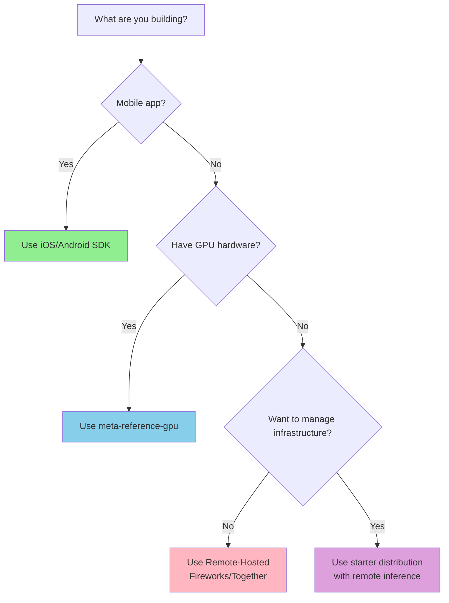

# Distributions

## What is a Distribution?

A **Llama Stack Distribution** (or **Distro**) is a pre-configured package that bundles:
- A specific set of **API providers** (inference, memory, safety, etc.)
- **Configuration files** (`run.yaml`) with sensible defaults
- **Dependencies** needed to run those providers

Think of distributions as "starter templates" that package everything you need for specific use cases.

### Why Distributions?

While Llama Stack offers flexibility to mix-and-match providers, most users work with specific combinations based on:
- **Hardware availability** (GPU vs CPU)
- **Deployment environment** (cloud vs edge vs local)
- **Provider preferences** (open-source vs managed services)

Distributions provide a convenient shorthand for these common combinations, saving you from manually configuring each component.

## Distribution vs Deployment

It's important to understand the difference:

| Concept | What it is | Example |
|---------|-----------|---------|
| **Distribution** | _What_ you're running (the package) | `starter`, `meta-reference-gpu` |
| **Deployment** | _How/Where_ you're running it | Docker container, K8s cluster, library mode |

**Example**: You might choose the `starter` distribution and deploy it:
- As a Docker container for testing
- In a Kubernetes cluster for production
- As a Python library for development

## Types of Distributions

### 1. Remotely Hosted Distributions

**Best for**: Production use without infrastructure management

These distributions are fully managed by third-party providers. You simply:
1. Obtain an API key
2. Point to their URL
3. Get all Llama Stack APIs working instantly

**Available Providers**:
- [Fireworks.ai](https://fireworks.ai/) - Production-ready managed Llama Stack
- [Together.xyz](https://together.xyz/) - Scalable hosted solution

**When to use**:
- ✅ You want to focus on building, not infrastructure
- ✅ You need production reliability without DevOps overhead
- ✅ You're okay with using a managed service

**Learn more**: [Remote-Hosted Distributions](/docs/distributions/remote_hosted_distro/)

### 2. Self-Hosted Distributions

**Best for**: Custom infrastructure, specific hardware, or self-contained deployments

Run Llama Stack on your own infrastructure with control over all components.

#### `distribution-starter`
**Recommended for beginners and remote inference**

- **Inference**: Ollama (local CPU) or remote providers (Fireworks, Together, vLLM, TGI)
- **Hardware**: Any machine (CPU is sufficient)
- **Use cases**: Prototyping, development, remote inference deployments

```bash
docker pull llamastack/distribution-starter
```

**Learn more**: [Starter Distribution Guide](/docs/distributions/self_hosted_distro/starter)

#### `distribution-meta-reference-gpu`
**For GPU-powered local inference**

- **Inference**: Meta Reference implementation (PyTorch-based)
- **Hardware**: NVIDIA GPU required (24GB+ VRAM recommended)
- **Use cases**: Maximum control, on-premises GPU deployments

```bash
docker pull llamastack/distribution-meta-reference-gpu
```

**Learn more**: [Meta Reference GPU Guide](/docs/distributions/self_hosted_distro/meta-reference-gpu)

#### `nvidia` Distribution
**For NVIDIA NeMo Microservices**

- **Inference**: NVIDIA NIM (NeMo Inference Microservices)
- **Hardware**: NVIDIA GPU with NeMo support
- **Use cases**: Enterprise NVIDIA stack integration

**Learn more**: [NVIDIA Distribution Guide](/docs/distributions/self_hosted_distro/nvidia)

**When to use self-hosted**:
- ✅ You have specific hardware requirements (GPUs, on-prem)
- ✅ You need full control over data and infrastructure
- ✅ You want to customize provider configurations
- ✅ You're subject to data residency requirements

### 3. On-Device Distributions

**Best for**: Mobile apps and edge computing

Run Llama Stack directly on mobile devices with optimized on-device inference.

**Available SDKs**:
- [iOS SDK](/docs/distributions/ondevice_distro/ios_sdk) - Native Swift implementation
- [Android SDK](/docs/distributions/ondevice_distro/android_sdk) - Native Kotlin implementation

**When to use**:
- ✅ You're building mobile applications
- ✅ You need offline/edge inference capabilities
- ✅ You want low-latency responses on devices

## Choosing a Distribution

### Decision Tree



### Quick Recommendations

| Scenario | Distribution | Deployment Mode |
|----------|--------------|-----------------|
| Just starting out | `starter` | Local Docker |
| Developing with remote APIs | `starter` | Library mode |
| Production with GPUs | `meta-reference-gpu` | Kubernetes |
| Production without managing infra | Remote-hosted | Fireworks/Together |
| Mobile app | iOS/Android SDK | On-device |

## Next Steps

1. **Explore distributions**: [Available Distributions](/docs/distributions/list_of_distributions)
2. **Choose deployment mode**: [Starting Llama Stack Server](/docs/distributions/starting_llama_stack_server)
3. **Deploy to production**: [Deploying Llama Stack](/docs/deploying/)
4. **Build applications**: [Building Applications](/docs/building_applications/)

## Common Questions

### Can I switch distributions later?

Yes! Llama Stack's standardized APIs mean your application code remains the same regardless of which distribution you use. You can:
- Develop with `starter` + Ollama locally
- Test with `starter` + Docker container
- Deploy with `meta-reference-gpu` in Kubernetes

### Can I customize a distribution?

Absolutely! See:
- [Building Custom Distributions](/docs/distributions/building_distro)
- [Customizing Configuration](/docs/distributions/customizing_run_yaml)

### What's the difference between a distribution and a provider?

- **Provider**: Implementation of a specific API (e.g., Ollama for inference)
- **Distribution**: Bundle of multiple providers configured to work together
