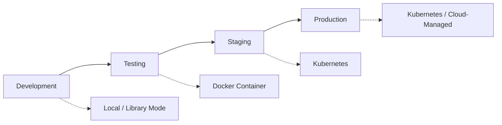

import Tabs from '@theme/Tabs';
import TabItem from '@theme/TabItem';

# Deploying Llama Stack

This guide helps you understand how to deploy Llama Stack across different environments—from local development to production.

## Understanding Llama Stack Deployment

Llama Stack can be deployed in multiple ways, each suited for different stages of your development lifecycle:



### Deployment Modes

Llama Stack supports three primary deployment modes:

1. **Library Mode** (Development)
   - No server required
   - Perfect for prototyping and local testing
   - Uses external inference services (Fireworks, Together, etc.)
   - See: [Using Llama Stack as a Library](/docs/distributions/importing_as_library)

2. **Container Mode** (Testing & Staging)
   - Pre-built Docker images with all providers
   - Consistent environment across systems
   - Easy to start with `docker run`
   - See: [Available Distributions](/docs/distributions/list_of_distributions)

3. **Kubernetes Mode** (Production)
   - Scalable and highly available
   - Production-grade orchestration
   - Support for AWS EKS and other K8s platforms
   - See deployment guides below

## Choosing Your Deployment Strategy

### Start Here: Development

If you're just starting out:

1. **Begin with the [Quickstart Guide](/docs/getting_started/quickstart)** - Get Llama Stack running locally in minutes
2. **Use Library Mode or `starter` Distribution** - No complex infrastructure needed
3. **Prototype your application** with Ollama or remote inference providers

### Moving to Testing & Staging

Once your application is working locally:

1. **Containerize with Docker** - Package your app with a distribution
2. **Choose the right distribution** for your hardware:
   - `distribution-starter` for CPU/remote inference
   - `distribution-meta-reference-gpu` for GPU inference
   - See: [Available Distributions](/docs/distributions/list_of_distributions)
3. **Configure environment variables** for your providers

### Production Deployment

For production workloads:

1. **Deploy to Kubernetes** using our guides below
2. **Configure monitoring and logging** - See [Telemetry](/docs/building_applications/telemetry)
3. **Set up proper secrets management** for API keys
4. **Consider managed hosting** for turnkey production:
   - [Fireworks.ai](https://fireworks.ai)
   - [Together.xyz](https://together.xyz)

## Production Deployment Guides

### Self-Hosted Production

<div style={{display: 'flex', gap: '1rem', marginBottom: '2rem'}}>
  <a href="./kubernetes_deployment"
     style={{
       flex: 1,
       padding: '1.5rem',
       border: '2px solid var(--ifm-color-primary)',
       borderRadius: '0.5rem',
       textDecoration: 'none',
       color: 'inherit'
     }}>
    <h3>🚢 Kubernetes Deployment</h3>
    <p>Deploy Llama Stack to any Kubernetes cluster with full control over infrastructure and scaling</p>
  </a>

  <a href="./aws_eks_deployment"
     style={{
       flex: 1,
       padding: '1.5rem',
       border: '2px solid var(--ifm-color-primary)',
       borderRadius: '0.5rem',
       textDecoration: 'none',
       color: 'inherit'
     }}>
    <h3>☁️ AWS EKS Deployment</h3>
    <p>Deploy on Amazon EKS with optimized configurations for AWS infrastructure</p>
  </a>
</div>

### Managed Hosting

For production deployments without infrastructure management, consider **remote-hosted distributions** from:
- [Fireworks.ai](https://fireworks.ai) - Fully managed Llama Stack API
- [Together.xyz](https://together.xyz) - Production-ready hosting

See: [Remote-Hosted Distributions](/docs/distributions/remote_hosted_distro/)

## Common Deployment Patterns

### Pattern 1: Local Development → Cloud Production

```bash
# 1. Develop locally with Ollama
ollama run llama3.2:3b
llama stack run starter

# 2. Test with containers
docker run -p 8321:8321 llamastack/distribution-starter

# 3. Deploy to Kubernetes (see K8s guide)
kubectl apply -f llama-stack-deployment.yaml
```

### Pattern 2: Remote Inference Throughout

```bash
# 1. Develop with remote inference (no local models)
export FIREWORKS_API_KEY=your_key
llama stack run starter

# 2. Deploy with same remote providers
# → No model downloads or GPU requirements
# → Consistent behavior across environments
```

### Pattern 3: Edge/On-Device Deployment

For mobile or edge devices:
- [iOS SDK](/docs/distributions/ondevice_distro/ios_sdk)
- [Android SDK](/docs/distributions/ondevice_distro/android_sdk)

## Key Concepts

### Distributions vs Deployments

- **Distribution**: A pre-configured package of Llama Stack with specific providers (e.g., `starter`, `meta-reference-gpu`)
- **Deployment**: How you run that distribution (library mode, Docker container, K8s cluster)

Think of distributions as "what" and deployments as "where/how".

### Configuration Management

All deployment modes use a `run.yaml` configuration file:

```yaml
apis:
  - agents
  - inference
  - memory
  - safety

providers:
  inference:
    - type: ollama
      config:
        url: ${env.OLLAMA_URL:http://localhost:11434}
```

See: [Configuration Reference](/docs/distributions/configuration)

## Next Steps

1. **New to Llama Stack?** Start with the [Quickstart Guide](/docs/getting_started/quickstart)
2. **Ready for containers?** Check [Available Distributions](/docs/distributions/list_of_distributions)
3. **Going to production?** Follow the [Kubernetes](#production-deployment-guides) or [AWS EKS](#production-deployment-guides) guides
4. **Need help choosing?** See our [Distribution Decision Flow](/docs/distributions/list_of_distributions#decision-flow)

## Support

- [GitHub Discussions](https://github.com/llamastack/llama-stack/discussions) - Community support
- [GitHub Issues](https://github.com/llamastack/llama-stack/issues) - Bug reports
- [Example Applications](https://github.com/llamastack/llama-stack-apps) - Reference implementations
