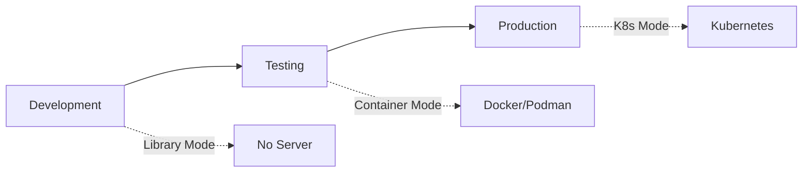

# Starting a Llama Stack Server

Llama Stack servers can be run in three primary ways, each suited for different stages of your development lifecycle:

## Deployment Lifecycle Overview



Choose the deployment mode that matches your current development stage:

| Stage | Mode | When to Use |
|-------|------|-------------|
| **Development** | Library Mode | Prototyping, no local models needed |
| **Testing** | Container Mode | Consistent testing across environments |
| **Production** | Kubernetes Mode | Scalable, production-ready deployments |

---

## 1. Library Mode (Development)

**Best for**: Quick prototyping without running a server

This is the simplest way to get started. Using Llama Stack as a library means you do not need to start a server. This is especially useful when you are not running inference locally and relying on an external inference service (e.g. Fireworks, Together, Groq, etc.)

**How it works**:
- Import Llama Stack directly into your Python code
- No server process needed
- Perfect for Jupyter notebooks and scripts

**Example**:
```python
from llama_stack_client import LlamaStackClient

# Use remote inference provider directly
client = LlamaStackClient(
    base_url="https://llama-stack.fireworks.ai",
    api_key="your-api-key"
)
```

**Learn more**: [Using Llama Stack as a Library](importing_as_library)

---

## 2. Container Mode (Testing & Staging)

**Best for**: Testing before production deployment

Another simple way to start interacting with Llama Stack is to spin up a container (via Docker or Podman) which is pre-built with all the providers you need. We provide a number of pre-built images so you can start a Llama Stack server instantly.

**How it works**:
- Pull a pre-built distribution image
- Run with `docker run` or `podman run`
- Configure via environment variables

**Example**:
```bash
# Pull the starter distribution
docker pull llamastack/distribution-starter

# Run the server
docker run -p 8321:8321 \
  -e OLLAMA_URL=http://host.docker.internal:11434 \
  llamastack/distribution-starter
```

**Choosing a distribution**: Which distribution to choose depends on your hardware. See [Available Distributions](./list_of_distributions) for details.

**When to use containers**:
- ✅ Testing your application in a consistent environment
- ✅ Sharing setups with team members
- ✅ CI/CD pipelines
- ✅ Staging environments before Kubernetes

---

## 3. Kubernetes Mode (Production)

**Best for**: Production deployments at scale

If you have built a container image and want to deploy it in a Kubernetes cluster instead of starting the Llama Stack server locally, we provide comprehensive deployment guides.

**How it works**:
- Deploy container images to K8s clusters
- Configure scaling, monitoring, and high availability
- Manage with kubectl or Helm charts

**Example**:
```bash
# Deploy to Kubernetes
kubectl apply -f llama-stack-deployment.yaml

# Scale deployment
kubectl scale deployment llama-stack --replicas=3
```

**Production deployment guides**:
- [Kubernetes Deployment Guide](../deploying/kubernetes_deployment) - General K8s deployment
- [AWS EKS Deployment Guide](../deploying/aws_eks_deployment) - AWS-specific setup

**When to use Kubernetes**:
- ✅ Production workloads requiring high availability
- ✅ Auto-scaling based on load
- ✅ Multi-region deployments
- ✅ Enterprise-grade monitoring and logging

---

## Choosing Your Deployment Mode

### Development Phase
Start with **Library Mode** if:
- You're prototyping or learning Llama Stack
- You're using remote inference providers (no local models)
- You don't need a standalone server

### Testing Phase
Move to **Container Mode** when:
- You need consistent testing environments
- Multiple team members are developing
- You're integrating with CI/CD pipelines
- You want to test with local models (Ollama, vLLM)

### Production Phase
Deploy with **Kubernetes Mode** when:
- You need production-grade reliability
- Auto-scaling is required
- You have DevOps infrastructure in place
- You need multi-region or high-availability setups

---

## Configure Logging

Control log output via environment variables before starting the server (works for all deployment modes):

```bash
# Set per-component log levels
export LLAMA_STACK_LOGGING=server=debug,core=info

# Mirror logs to a file
export LLAMA_STACK_LOG_FILE=/path/to/log
```

**Supported categories**: `all`, `core`, `server`, `router`, `inference`, `agents`, `safety`, `eval`, `tools`, `client`

**Levels**: `debug`, `info`, `warning`, `error`, `critical` (default: `info`)

**Examples**:
```bash
# Debug all components
export LLAMA_STACK_LOGGING=all=debug

# Debug server, info for everything else
export LLAMA_STACK_LOGGING=server=debug,all=info
```

Export these variables prior to running `llama stack run`, launching a container, or starting the server through any other pathway.

---

## Next Steps

1. **New to Llama Stack?** Start with [Library Mode](#1-library-mode-development)
2. **Ready to test?** Try [Container Mode](#2-container-mode-testing--staging)
3. **Going to production?** Follow the [Kubernetes guides](#3-kubernetes-mode-production)
4. **Need help choosing?** See [Choosing Your Deployment Mode](#choosing-your-deployment-mode)

```{toctree}
:maxdepth: 1
:hidden:

importing_as_library
configuration
```
